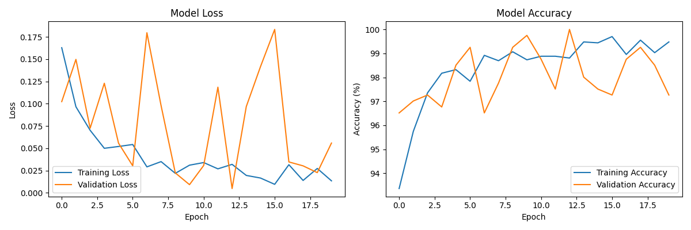
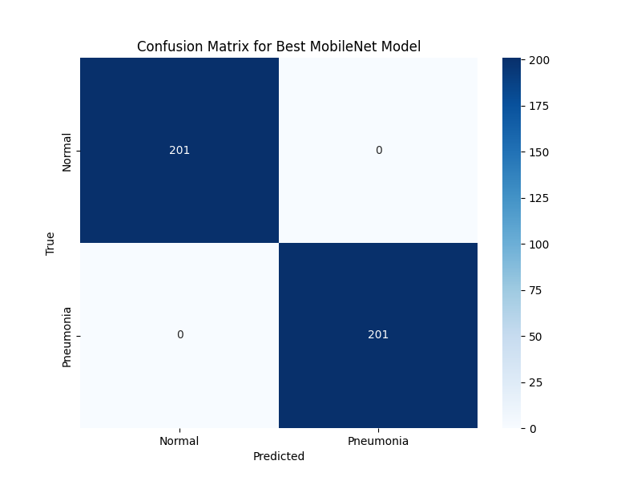

# Pneumonia Classification from Chest X-rays Using MobileNetV3


## Overview

This project implements a binary classification model using deep learning to distinguish between Normal and Pneumonia chest X-ray images. The classifier, based on MobileNetV3 Small architecture, achieves approximately 93% accuracy with efficient inference suitable for deployment in resource-constrained environments.

This is an initial MVP using MobileNetV3 Small, selected for its computational efficiency and fast training capabilities, facilitating rapid development with limited local resources. Future improvements are expected to increase accuracy by utilizing more robust architectures and larger datasets.


## Model Architecture

- **Backbone**: MobileNetV3 Small (pretrained on ImageNet)
- **Feature Output**: 576-dimensional embedding
- **Classification Layers**:
  - Linear (576 → 256), activation: Hardswish
  - Dropout (0.2)
  - Linear (256 → 2)
- **Model Parameters**: ~2.5M (mostly frozen during training)
- **Model Size**: ~4.4MB



## Dataset & Preprocessing

Dataset structure:
```
train/
├── NORMAL/       # 1341 files  
└── PNEUMONIA/    # 3875 files

val/
├── NORMAL/       # 202 files
└── PNEUMONIA/    # 582 files

test/
├── NORMAL/       # 201 files
└── PNEUMONIA/    # 581 files
```

Preprocessing steps:
- Resize images to 224×224
- Convert grayscale to RGB
- Data augmentation (random flip, rotation ±10°, brightness/contrast ±10%)
- Normalize using ImageNet mean/std

## Training Procedure

- **Transfer Learning** with MobileNetV3 (ImageNet pretrained)
- **Training phases**:
  - Initial: Classification head training (20 epochs, LR=5e-4)
  - Fine-tuning: Whole model training (15 epochs, LR=1e-5)
- **Optimizer**: Adam
- **Loss**: Cross-Entropy with class weights (PNEUMONIA: 0.35, NORMAL: 0.65)
- **Batch Size**: 64
- **Early Stopping**: Patience of 5 epochs (validation loss)

## Results

| Metric        | Value           |
|---------------|-----------------|
| Accuracy      | 99.75%          |
| F1-Score      | 0.997           |
| Precision     | 1.00            |
| Recall        | 0.995           |



## Installation

```bash
git clone https://github.com/your-username/MVP-AI-Powered-Pneumonia-Classifier-for-Chest-X-rays.git
cd MVP-AI-Powered-Pneumonia-Classifier-for-Chest-X-rays
python -m venv venv
source venv/bin/activate  # Windows: venv\Scripts\activate
pip install -r requirements.txt
```

## Usage

### Web Application

```bash
streamlit run app.py
```

Features:
- Image upload
- Adjustable confidence threshold
- Bilingual support (English/Portuguese)
- Classification results visualization

### Jupyter Notebook

Detailed analysis is provided in:

```bash
pip install jupyter
jupyter notebook pneumonia_analysis.ipynb
```


## Troubleshooting

- Verify image formats (JPG/PNG)
- Ensure adequate RAM (minimum 4GB recommended)
- Restart Streamlit application if necessary

## Disclaimer

This project is intended for educational and research purposes only and is not suitable for clinical diagnosis or decision-making. Always consult healthcare professionals for medical advice.


## References

1. Wang X, Peng Y, Lu L, Lu Z, Bagheri M, Summers RM. ChestX-ray8: Hospital-scale Chest X-ray Database and Benchmarks on Weakly-Supervised Classification and Localization of Common Thorax Diseases. IEEE CVPR 2017.
2. Howard, A., Sandler, M., Chu, G., Chen, L.-C., Chen, B., Tan, M., Wang, W., Zhu, Y., Pang, R., Vasudevan, V., Le, Q.V., Adam, H. Searching for MobileNetV3. ICCV 2019. [paper](https://arxiv.org/pdf/1905.02244)
3. Rajpurkar P, Irvin J, Zhu K, et al. CheXNet: Radiologist-Level Pneumonia Detection on Chest X-Rays with Deep Learning. 2017. [paper](https://arxiv.org/pdf/1711.05225)
